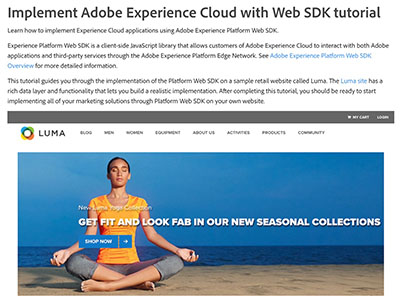

# Audience Manager 자습서

Audience Manager 자습서 사이트에 오신 것을 환영합니다. [설명서](https://experienceleague.adobe.com/docs/audience-manager/user-guide/aam-home.html?lang=ko)와 함께 이 튜토리얼을 사용하면 Adobe Audience Manager을 사용하여 Adobe의 동급 최고의 [!DNL data management platform]을(를) 사용하여 모든 채널 또는 장치에서 대상을 만들고 활성화하는 방법을 더 잘 이해할 수 있습니다.

* **직원 선택**&#x200B;은(는) 좋아하는 콘텐츠 중 일부를 강조 표시합니다.
* **왼쪽 탐색**&#x200B;에서 주제 및 하위 주제별로 내용 탐색
* 찾고 있는 내용을 알고 있는 경우 페이지 상단에 있는 **검색** 필드를 사용하십시오.

## 직원 추천

<table>
<tr>
  <td>
    
    

      <a href="https://experienceleague.adobe.com/docs/platform-learn/implement-web-sdk/overview.html?lang=ko-KR">
    <strong>Web SDK를 사용하여 Adobe Experience Cloud 구현 자습서</strong>
    </a>
    

    

    <em>Adobe Experience Platform Web SDK를 사용하여 Experience Cloud 응용 프로그램을 구현하는 방법에 대해 알아봅니다.</em>
    

  </td>
  <td>
    
    

      <a href="https://experienceleague.adobe.com/docs/audience-manager-learn/tutorials/other-integrations/integrating-with-rtcdp/rtcdp-segments-for-aam-users.html?lang=ko">
    <strong>Audience Manager 사용자를 위한 실시간 CDP의 세그먼트 이해</strong>
    </a>
    

    

    <em>이 비디오에서는 Audience Manager과 Real-Time CDP 간의 세그먼트 및 세그먼트 생성에서의 차이점을 살펴봅니다.</em>
    

  </td>
  <td>
    
    

      <a href="https://experienceleague.adobe.com/docs/audience-manager-learn/tutorials/build-and-manage-audiences/algorithmic-models/configure-and-report-on-predictive-audiences.html?lang=ko">
    <strong>Audience Manager에서 예측 대상 구성 및 보고</strong>
    </a>
    

    

    <em>이 비디오에서는 Audience Manager 인터페이스에서 Predictive Audiences 구성을 살펴봅니다.</em>
    

  </td>
</tr>
</table>

